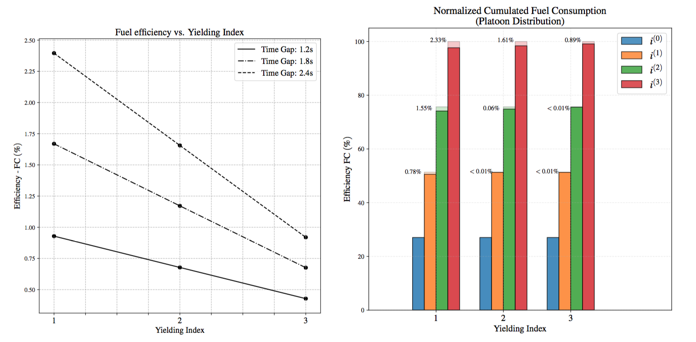

**| [Overview](#overview) | [Structure](#structure) | [Launching simulations](#launching-simulations) | [External tools](#external-tools) | [License](#license) | [Contact](#contact) |**

# Impact Platooning Environment

**Fuel consumption efficiency impact of truck platooning strategies**

Andres Ladino, Aurelien Duret, Nour-Eddin El Faouzi

## Overview 

This repository contains source code used to generate the example in *"Fuel consumption efficiency impact of truck platooning strategies: A sensitivity study at network discontinuities"* by [Andres Ladino](https://github.com/aladinoster),  [Aurelien Duret](https://www.researchgate.net/profile/Aurelien_Duret) and [Nour-Eddin El Faouzi](https://scholar.google.fr/citations?user=uiMicVIAAAAJ&hl=fr). 

## Structure 

In order to reproduce the calibration tests for fuel efficiency, request data by submitting an issue [here](https://github.com/research-licit/Energy-Impact-Platoon/issues/new). All experiments are available in the folder [notebook](notebook)

- Some data exploration: [DataExplore.ipynb](notebook/01-DataExplore.ipynb)
- Truck trips and maps: [PlotMap.ipynb](notebooks/02-PlotMap.ipynb)
- Fuel consumption data + Single truck dynamics: [FuelConsumption.ipynb](notebooks/03-FuelConsumption.ipynb)
- Impact of splitting platoons in terms of fuel consumption: [Evaluation.ipynb](notebooks/05-Evaluation.ipynb)

## Launching simulations 

- Run `platoon-closed.py` and collect the data in the folder [/output](output). 
- Run the impact analysis in `Evaluation.ipynb`.

## External tools

- [Jupyter Notebook](https://jupyter.readthedocs.io/en/latest/)
- [ipyleaflef](https://ipyleaflet.readthedocs.io/en/latest/installation.html)
- [gmplot](https://github.com/vgm64/gmplot)

## License

These notebooks are licensed under [MIT License](https://github.com/research-licit/Energy-Impact-Platoon/blob/master/LICENSE)

## Contact 

If you run into problems or bugs, please let us know by [creating an issue](https://github.com/research-licit/Energy-Impact-Platoon/issues/new) an issue in this repository.